# portfolio
Portfólio com alguns websites / app desenvolvidos.

#### 1. **<a href="https://medbeapp.com/"> 📱 Websites </a>**
Websites desenvolvidos para o projeto do aplicativo MedBe. 
Disponível publicamente em: www.medbeapp.com

  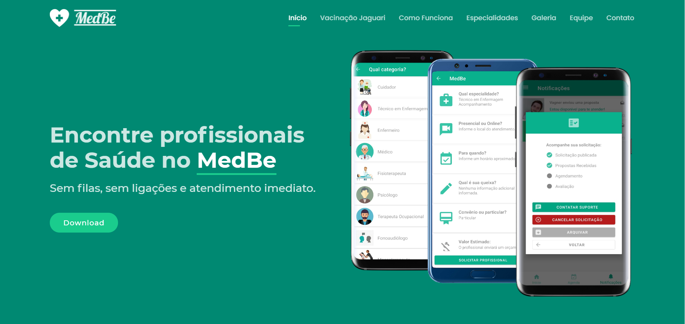

  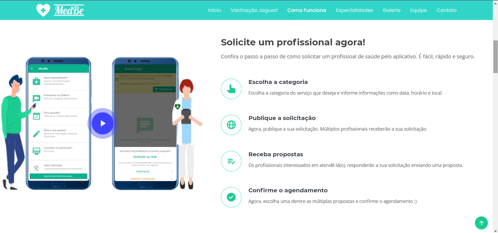

  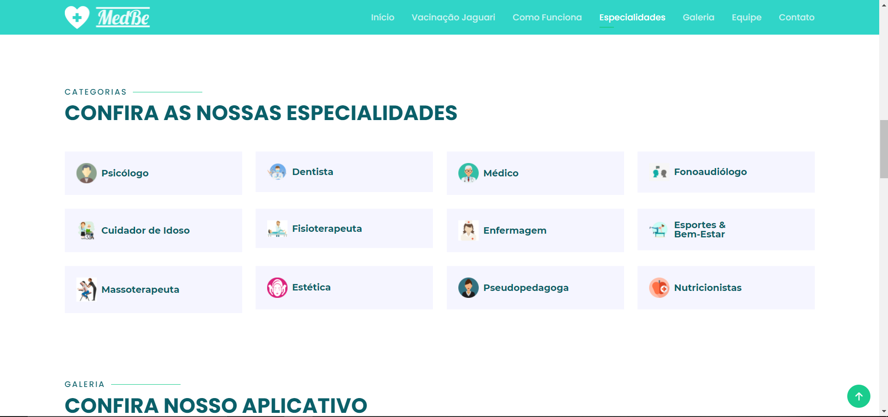

  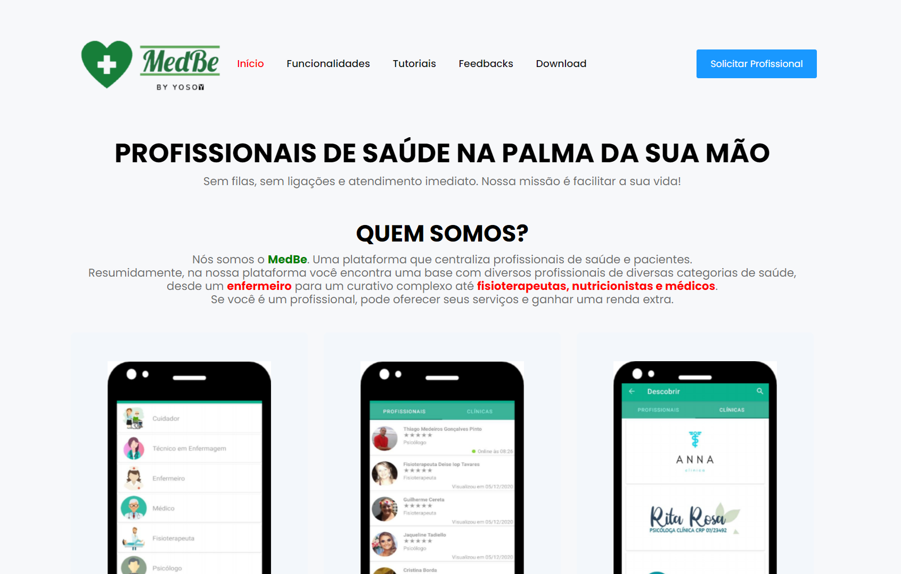

  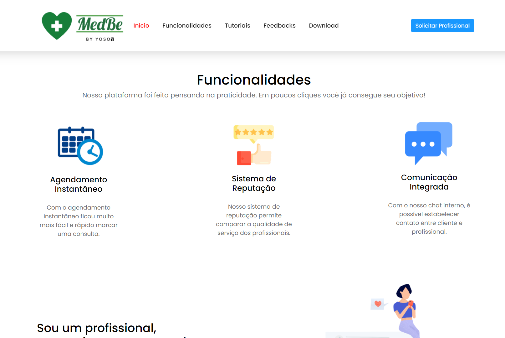

  

  

  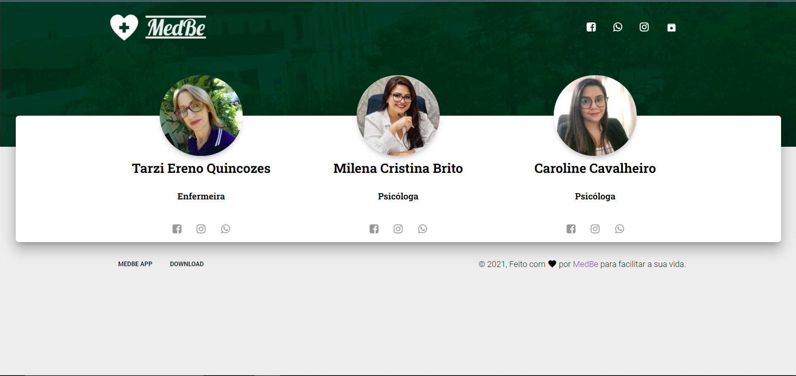

  

  

  

#### 1. **<a href="https://repositorio.unipampa.edu.br/jspui/handle/riu/5611"> 📱 Aplicativo Identifica ISP </a>**
Aplicativo desenvolvido durante os Trabalhos de Conclusão de Curso I e II, requisitos para obtenção do título de bacharel em Engenharia de Software.
Disponível publicamente em: https://repositorio.unipampa.edu.br/jspui/handle/riu/5611

  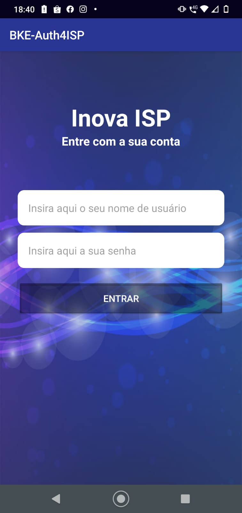
  
  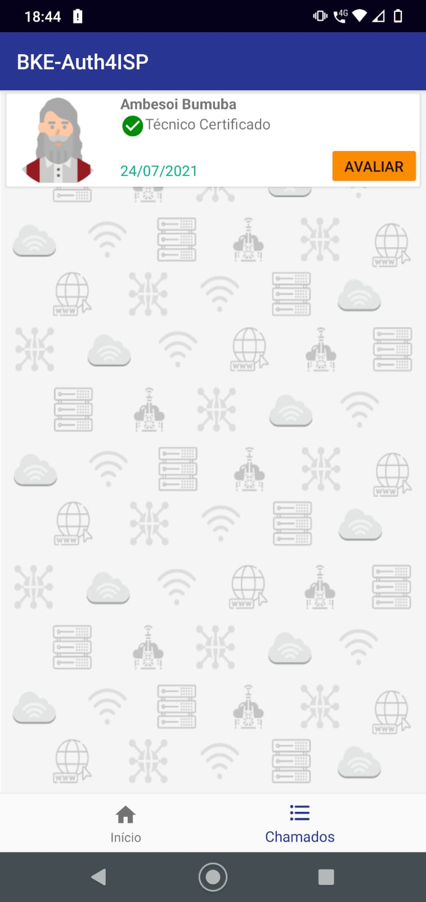
  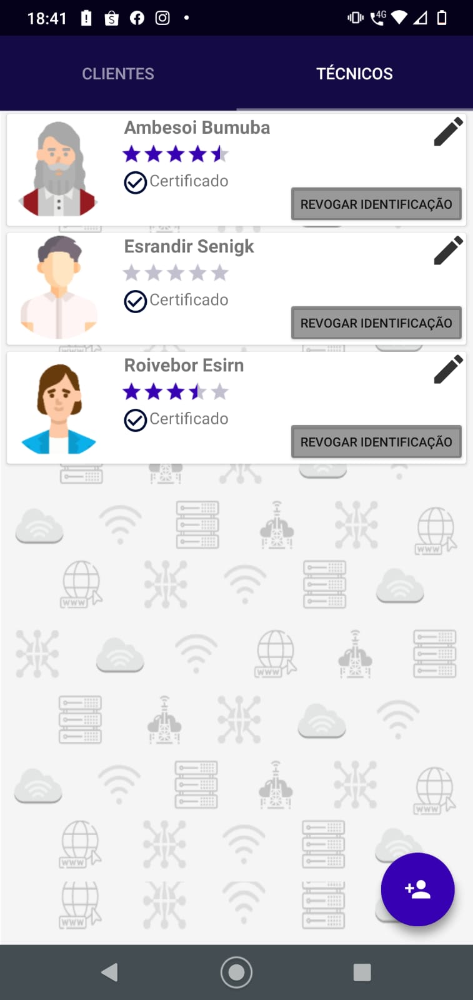

  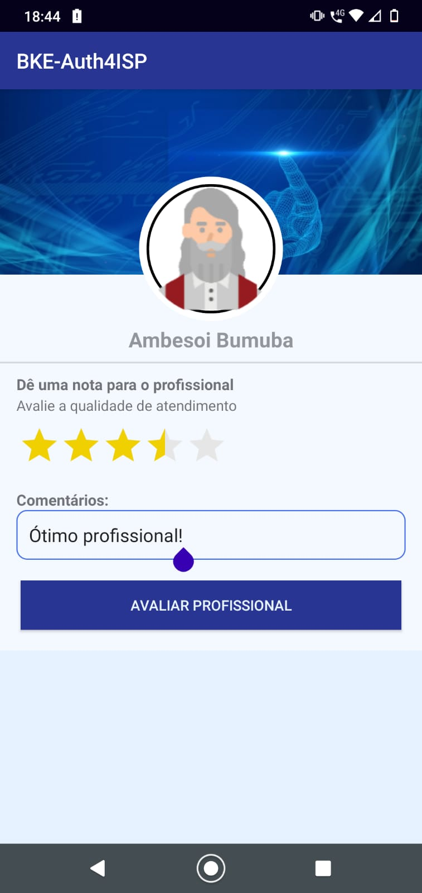
  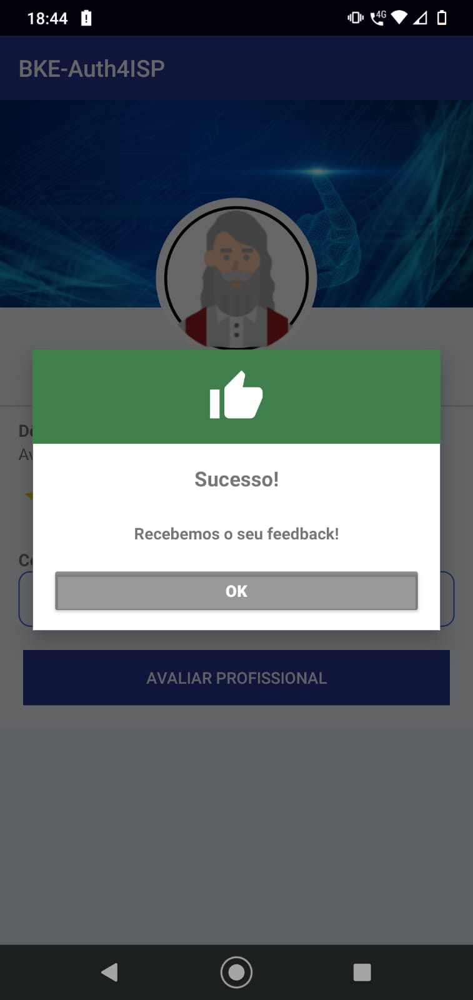
  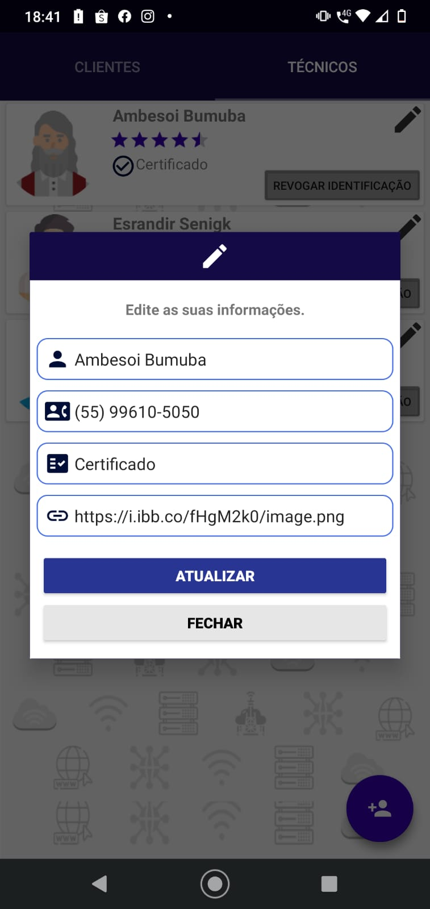

#### 1. **<a href="baixe.medbeapp.com"> 🖥️ Aplicativo MedBe </a>**
Aplicativo desenvolvido em conjunto com o projeto MedBe. 
Disponível publicamente em: baixe.medbeapp.com

  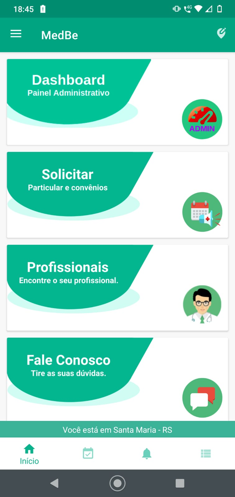
  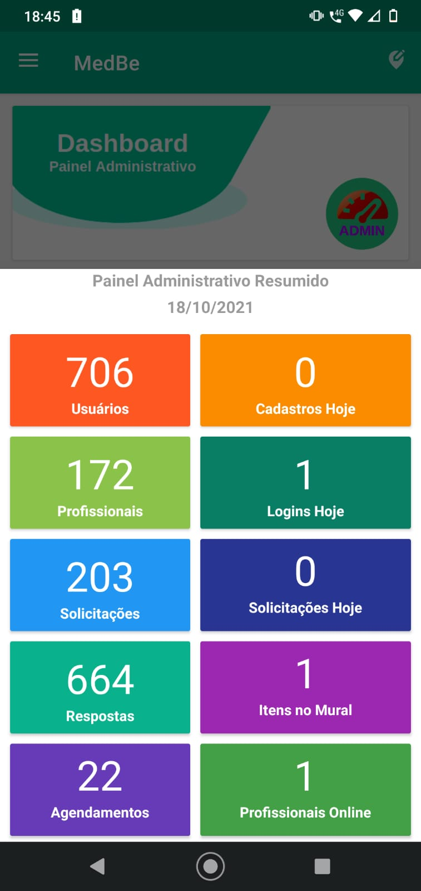
  
  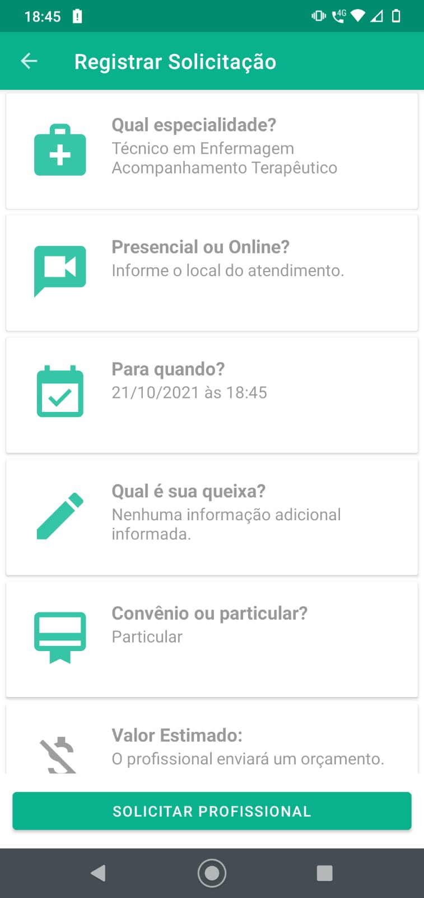

  
  
  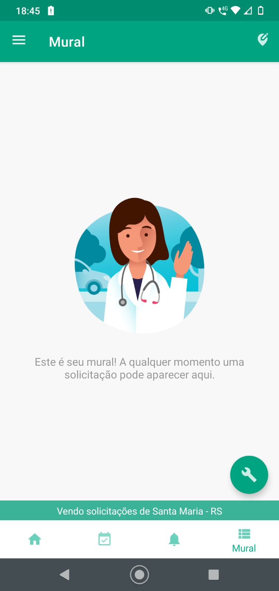
  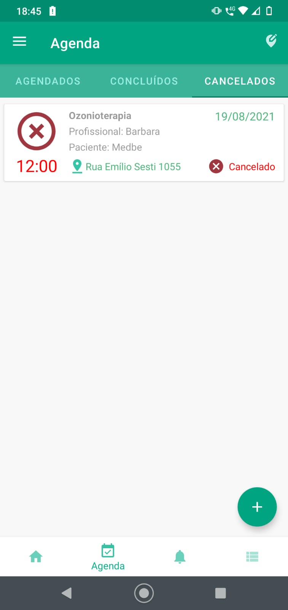

